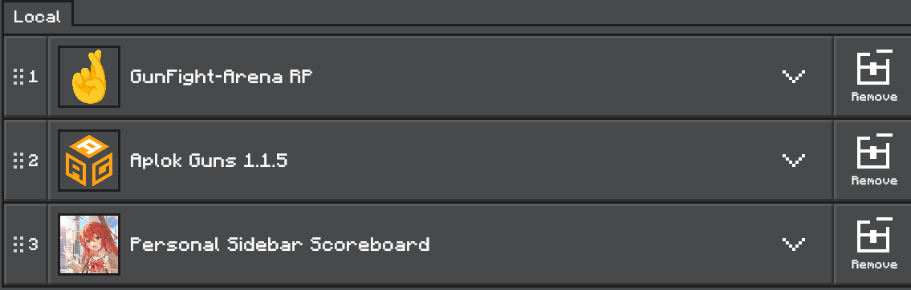
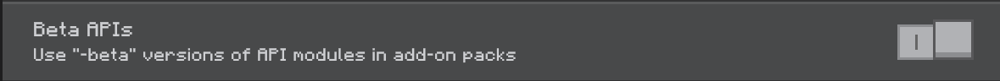
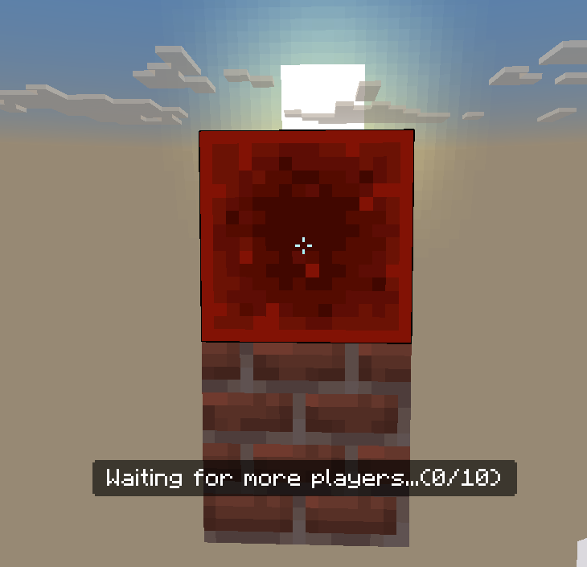

# GunFight Arena

[**中文** | [English](README_en.md)]

## ℹ️ 資訊

**GunFight Arena** 是一款 Minecraft Bedrock Edition 上的槍戰遊戲模組，支援多人遊玩，並提供多種模式。

> [!IMPORTANT]
> 該版本在之後不會再有大更新，我會開始著手設計第二版，最主要的改變內容有:
> 
> 1. 更有條理的程式架構
> 2. 自己設計的槍枝系統和 UI 介面
>
> 這將會是一個很長遠的計畫，希望能夠將這份專案延續下去。

---
## 📦 安裝遊戲

對於安裝遊戲，你有兩種選擇，下方分別做說明。

**方法1️⃣ : 安裝 `.mcworld` 檔案**

1. 在 **Releases** 尋找合適的版本，並下載 `.mcworld` 檔案。
2. 打開檔案會自動導入遊戲。 

**方法2️⃣ : 安裝 `.mcpack` 檔案**

1. 在 **Releases** 尋找合適的版本，並下載 `.mcpack` 檔案。
2. 打開檔案後會自動導入遊戲。
3. 下載對應版本的 ***Aplok Guns*** 和 ***Personal Sidebar Scoreboard*** (你可以在 **貢獻** 找到連結)
4. 創建您的世界，並且將行為包和資源包按照以下順序導入
    - 行為包 Behavior Pack
    
    - 資源包 Resource Pack
     
5. 開啟 `Experiments` -> `Beta APIs`
     

---

## 📘 遊戲內使用

### ⚙️ 遊戲初始化設定

> [!WARNING]
> **如果您使用 `.mcworld` 的安裝方式，則不需要再次進行初始化設定。** \
> **只有在使用 `.mcpack` 的安裝方式時才需要初始化。**

1. 給予自己 `admin` 的標籤
2. 輸入指令 `/function gf/setting/{position}` 來設定不同的點
    - 輸入指令後，系統會紀錄玩家的準星對準的方塊座標進行設定
    - 設定 `blue`/`red`/`bomb`/`lobby` 等傳送點座標時，請在預期的位置多放上一格方塊，並用準星對準後，再輸入指令來設定。
        > 下圖是範例，如果你的傳送點是在磚塊上方，請在磚塊上方放上另一個方塊，並將準星對準該方塊來設定，否則傳送點將會出現錯誤。 \
        > 


### 🤖 遊戲內指令

**所有玩家均可使用**
```
/function gf/join      # 加入遊戲
/function gf/left      # 離開遊戲
/function gf/gamestart # 開始遊戲
/function gf/stat      # 獲取自己的生涯遊戲紀錄
```

**以下只有擁有 `admin` 標籤的玩家可以使用**
```
/function gf/setting/clear        # 清除所有設定
/function gf/setting/blue         # 設定藍隊重生點
/function gf/setting/red          # 設定紅隊重生點
/function gf/setting/bomb         # 設定炸彈包重生點
/function gf/setting/bomb_targets # 設定安裝炸彈的點位 (如有多個點位，可以重複輸入該指令來設定)
/function gf/setting/container    # 設定特殊儲存箱的位置
```

---
## 🎮 遊戲玩法

### 💣 Demolition (爆破模式)

- **遊戲規則**:
    - 玩家分為 **紅隊 (進攻方)** 和 **藍隊 (防守方)**。
    - 進攻方的目標是安裝炸彈，防守方則必須阻止並拆除炸彈。
    - 若炸彈成功引爆或所有防守方玩家被淘汰，則紅隊獲勝；反之，藍隊獲勝。
    - 遊戲在回合總數過半時，會進行攻守交換。

- **操作方式**:
    - 回合前的準備階段，`右鍵` 點擊背包中的**羽毛**能夠開啟商店。
    - 手持炸彈包，按住 `右鍵` 可以安裝炸彈包。手持剪線鉗，按住 `右鍵`可以拆除炸彈包。
    - 紅隊成員可以點擊 `右鍵` 掉落的炸彈包，將其撿起。
    - 將炸彈包丟出背包，炸彈包會變成掉落狀態，點擊 `右鍵` 可以再次撿起。
    - 手持武器時: \
        a. `蹲下` 可以進入瞄準狀態 \
        b. 按下 `右鍵` 可以射擊 \
        c. `蹲下` + `左鍵` 可以安裝子彈

---
## 📜 貢獻

**👤Author**: [@xigma0512](https://github.com/xigma0512) \
**🎨AplokGun Addon**: [Aplok Guns](https://mcpedl.com/aplok-guns/), developed by [@GabrielAplok](https://github.com/gabriel-aplok/)\
**⭐Personal Sidebar Scoreboard**: [Youtube](https://www.youtube.com/watch?v=6fFCAAD8vUs&ab_channel=MonkeyChan), developed by [@MonkeyChan](https://www.youtube.com/@MonkeyChan118 )

---
## 🏛️ License
This project is licensed under the MIT License. See the LICENSE file for details.