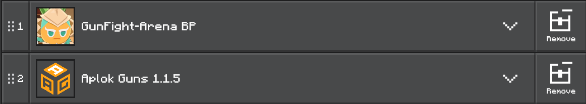
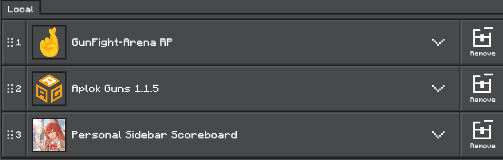
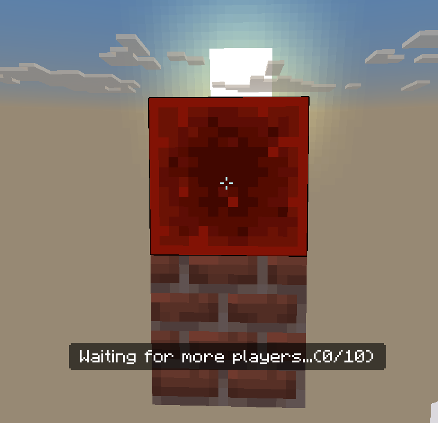
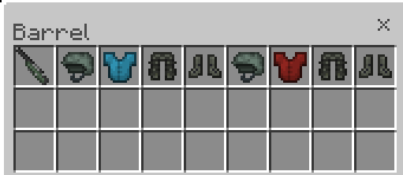

# GunFight Arena

[**中文** | [English](README_en.md)]

## ℹ️ Information

**GunFight Arena** is a gunfight game mod for Minecraft Bedrock Edition that supports multiplayer gameplay and offers multiple modes.

> [!IMPORTANT]
> This version will no longer receive major updates as I will begin designing the second version. The main changes include:
> 
> 1. A more structured code architecture
> 2. A custom-designed weapon system and UI
>
> This is a long-term project, and I hope to continue its development.

---
## 📦 Game Installation

There are two methods for installing the game, explained below.

**Method 1️⃣: Installing the `.mcworld` File**

1. In **Releases**, find the appropriate version and download the `.mcworld` file.
2. Open the file to automatically import it into the game.

**Method 2️⃣: Installing the `.mcpack` File**

1. In **Releases**, find the appropriate version and download the `.mcpack` file.
2. Open the file to automatically import it into the game.
3. Download the corresponding versions of ***Aplok Guns*** and ***Personal Sidebar Scoreboard*** (you can find the links in the **Contributions** section).
4. Create your world, then import the behavior pack and resource pack in the following order:
    - **Behavior Pack**
      
    - **Resource Pack**
      
---

## 📘 In-Game Usage

### ⚙️ Game Initialization Settings

> [!WARNING]
> **If you installed the game using the `.mcworld` method, you DO NOT need to perform the initialization settings.**  
> **Initialization is only required if you installed the game using the `.mcpack` method.**

1. Assign yourself the `admin` tag.
2. Enter the command `/function gf/setting/{position}` to set various points.
    - After entering the command, the system will record the coordinates of the block that your crosshair is targeting.
    - When setting teleportation points such as `blue`/`red`/`bomb`/`lobby`, please place an extra block at the intended location and target that block with your crosshair before executing the command.
        > The image below is an example. If your teleportation point is above a brick block, please place another block above it and target that block when setting the point, otherwise the teleportation point may be incorrect.  
        > 

3. **Special Storage Container** (setting with `/function gf/setting/container`) must be a container (chest/barrel) located in a loaded chunk; otherwise, an error will occur.
    - The default item placement is as follows: the first slot must contain an **AWP with a scope**.
    

### 🤖 In-Game Commands

**Commands available to all players:**
```
/function gf/join      # Join the game
/function gf/left      # Leave the game
/function gf/gamestart # Start the game
/function gf/stat      # View your career game statistics
```

**Commands available only to players with the `admin` tag:**
```
/function gf/setting/clear        # Clear all settings
/function gf/setting/blue         # Set the Blue Team's respawn point
/function gf/setting/red          # Set the Red Team's respawn point
/function gf/setting/bomb         # Set the bomb package respawn point
/function gf/setting/bomb_targets # Set the bomb installation points (if there are multiple points,
                                    you can run this command repeatedly to set them) 
/function gf/setting/container    # Set the location of the special storage box
```


---
## 🎮 Gameplay

### 💣 Demolition

- **Game Rules:**
    - Players are divided into **Red Team (Attackers)** and **Blue Team (Defenders)**.
    - The attackers' objective is to plant the bomb, while the defenders must prevent and defuse it.
    - If the bomb successfully explodes or all defenders are eliminated, the Red Team wins; otherwise, the Blue Team wins.
    - The sides will be switched when more than half of the total rounds have been played.

- **How to Play:**
    - During the preparation phase, `Right-Click` the **feather** in your inventory to open the shop.
    - While holding the bomb package, hold `Right-Click` to plant it. While holding the wire cutters, hold `Right-Click` to defuse the bomb package.
    - Red Team members can `Right-Click` on a dropped bomb package to pick it up.
    - If you drop the bomb package from your inventory, it will become an item on the ground; you can pick it up again by `Right-Click` it.
    - When holding a weapon:
        a. `Sneak` to enter aiming mode  
        b. Press `Right-Click` to shoot  
        c. `Sneak` + `Left-Click` to reload

---
## 📜 Contributions

**👤Author**: [@xigma0512](https://github.com/xigma0512)  
**🎨AplokGun Addon**: [Aplok Guns](https://mcpedl.com/aplok-guns/), developed by [@GabrielAplok](https://github.com/gabriel-aplok/)  
**⭐Personal Sidebar Scoreboard**: [YouTube](https://www.youtube.com/watch?v=6fFCAAD8vUs&ab_channel=MonkeyChan), developed by [@MonkeyChan](https://www.youtube.com/@MonkeyChan118)

---
## 🏛️ License
This project is licensed under the MIT License. See the LICENSE file for details.
